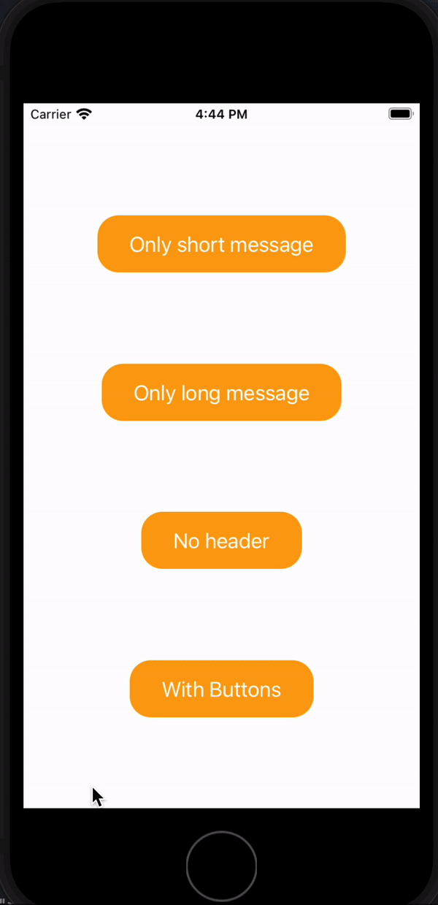

# React Native Modal Notifier
[](https://www.npmjs.com/package/react-native-modal-notifier)
[](https://www.npmjs.com/package/react-native-modal-notifier)

[](https://github.com/crazycoder-io/react-native-modal-notifier/blob/master/LICENSE)


**react-native-modal-notifier** is a third party in-app notification notifier package! It provides modal notification popup. And reachable from any screen or component after the wrap the application with container.
There are more than one usage example;
1. Can be triggered by `useEffect` function
2. Can be triggered by user action
3. Can be triggered by api service data

<p align="center">
    
</p>

## Installation
```sh
yarn add react-native-modal-notifier
```
Or
```sh
npm install --save react-native-modal-notifier
```

## Usage

Wrap your app with `NotifierContainer`
```js
import { NotifierContainer } from 'react-native-modal-notifier';
const App = () => (
  <NotifierContainer>
    <HomeScreen />
  </NotifierContainer>
);
```
Then import `useNotifier` anywhere in your code/screen/components
```js
import { useNotifier } from 'react-native-modal-notifier';

const HomeScreen = () => {
    const notifier = useNotifier();

    useEffect(() => {
        alert && notifier({
            title: alert.title,
            message: alert.message
        });
    }, [alert]);

    return (
    <TouchableHighlight
      onPress={() =>
        notifier({
          title: 'New Notification',
          message:
            'New Notification',
        })
      }>
      <Text>Set Notification</Text>
    </TouchableHighlight>
  );
};
```

## Props of useNotifier

| Name | Description | Type  | Default  |
|-----------------|:-------------|:---------------:|---------------:|
| title | Title of the message | string | `null` |
| message | The message of the content | string | `null` |
| headerShown | Header visibility option | boolean | `true` |
| primaryButtonText | The text in the primary button content | string | `undefined` |
| primaryButtonAction | The primary button action | func | `undefined` |
| primaryButtonColor | The background color of the primary button | string | `#3a86ff` |
| primaryButtonPosition | The position of the primary button in the notifier | `center` or `right` or `left` | `center` |
| type | The type of modal notifier | `default` or `info` or `warning` or `error` | `default` |
| childComponent | The child component to be rendered within the modal component | `JSX.Element` | `undefined` |
| contentImage | The image uri or address to be rendered within the modal | `ImageSourcePropType` | `undefined` |
| contentImageRadius | The image radius controller | boolean | `false` |
| contentImageSize | The size of the content image | `small` or `middle` or `large` | `middle` |
| contentImageType | The image type of content | `square` or `rectangle` | `square` |
